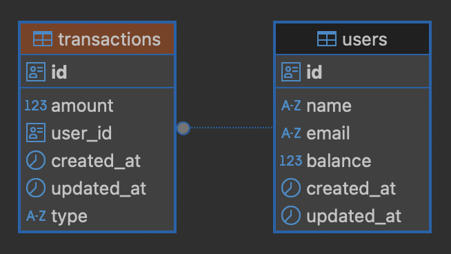

# yeet-vip

## Requirements
- Node.js (v20 or higher)
- Docker Desktop (must be running before setup)

## Setup

1. **IMPORTANT**: Make sure Docker Desktop is running first!

2. Make the setup script executable and run it:
```bash
chmod +x ./run.sh
./run.sh setup
```

This will:
- Clean up any existing Docker resources
- Install all dependencies
- Start Docker containers
- Run database migrations
- Seed initial data
- Start both frontend and backend servers

## Access Points
- Frontend: http://localhost:3000
- Backend API: http://localhost:3001
- Database: PostgreSQL on port 5432

## Development Scripts

### General
```bash
./run.sh setup     # First-time setup (install deps, start services, run migrations)
./run.sh up        # Start all services
./run.sh down      # Stop all services
./run.sh logs      # View all logs (or ./run.sh logs backend for specific service)
./run.sh restart   # Restart all services (or ./run.sh restart backend for specific)
./run.sh clean     # Remove all Docker resources for fresh start
./run.sh dev       # Install dependencies for local development
./run.sh purge     # Remove all Docker resources and node_modules for complete reset
```

### Troubleshooting
- If port 5432 is in use, stop any existing PostgreSQL service
- If setup fails, make sure Docker Desktop is actually running
- For clean slate: run `./run.sh clean` then `./run.sh setup`

## API Documentation

### User Endpoints

#### Get Users List
```http
GET /api/users
```

Query Parameters:
- `page` (number, optional): Page number for pagination (default: 1)
- `limit` (number, optional): Items per page (default: 10)
- `sortBy` (string, optional): Field to sort by (default: 'createdAt')
  - Allowed values: 'name', 'email', 'balance', 'createdAt'
- `sortOrder` (string, optional): Sort direction (default: 'DESC')
  - Allowed values: 'ASC', 'DESC'

Example Request:
```http
GET /api/users?page=1&limit=10&sortBy=balance&sortOrder=DESC
```

Response:
```json
{
  "users": [
    {
      "id": "uuid",
      "name": "John Doe",
      "email": "john@example.com",
      "balance": 1000.50,
      "createdAt": "2024-03-20T15:30:00Z"
    }
  ],
  "pagination": {
    "currentPage": 1,
    "totalPages": 5,
    "totalItems": 50,
    "itemsPerPage": 10
  }
}
```

#### Get Single User
```http
GET /api/users/:userId
```

Parameters:
- `userId` (uuid, required): The unique identifier of the user

Example Request:
```http
GET /api/users/123e4567-e89b-12d3-a456-426614174000
```

Response:
```json
{
  "user": {
    "id": "123e4567-e89b-12d3-a456-426614174000",
    "name": "John Doe",
    "email": "john@example.com",
    "balance": 1000.50,
    "createdAt": "2024-03-20T15:30:00Z"
  }
}
```

#### Credit/Debit User Balance
```http
PUT /api/users/:userId/update-balance
```

Parameters:
- `userId` (uuid, required): The unique identifier of the user

Request Body:
```typescript
{
  amount: number; // Positive for credit, negative for debit
}
```

Example Request:
```http
PUT /api/users/123e4567-e89b-12d3-a456-426614174000/update-balance
Content-Type: application/json

{
  "amount": 50.25  // Credit $50.25
}
```

Example Debit Request:
```http
PUT /api/users/123e4567-e89b-12d3-a456-426614174000/update-balance
Content-Type: application/json

{
  "amount": -25.50  // Debit $25.50
}
```

Response:
```json
{
  "message": "Credited $50.25 to user 123e4567-e89b-12d3-a456-426614174000",
  "newBalance": 1050.75,
  "transaction": {
    "id": "987fcdeb-51a2-3e4b-9876-543210987654",
    "userId": "123e4567-e89b-12d3-a456-426614174000",
    "amount": 50.25,
    "type": "ADMIN_ADJUST",
    "createdAt": "2024-03-20T15:35:00Z"
  }
}
```

Error Responses:
- 400: Invalid amount or insufficient funds
  ```json
  {
    "error": "Insufficient funds",
    "currentBalance": 100.00,
    "requestedDebit": 150.00
  }
  ```
- 404: User not found
  ```json
  {
    "error": "User not found"
  }
  ```
- 500: Internal server error
  ```json
  {
    "error": "Internal server error"
  }
  ```

#### Get Transactions For User
```http
GET /api/transactions/user/:userId
```

Parameters:
- `userId` (uuid, required): The unique identifier of the user

Example Request:
```http
GET /api/transactions/user/123e4567-e89b-12d3-a456-426614174000
```

Response:
```json
{
  "transactions": [
    {
      "id": "987fcdeb-51a2-3e4b-9876-543210987654",
      "userId": "123e4567-e89b-12d3-a456-426614174000",
      "amount": 50.25,
      "type": "ADMIN_ADJUST",
      "createdAt": "2024-03-20T15:35:00Z"
    },
    {
      "id": "456abcde-12f3-4g5h-ijkl-987654321012",
      "userId": "123e4567-e89b-12d3-a456-426614174000",
      "amount": -25.50,
      "type": "ADMIN_ADJUST",
      "createdAt": "2024-03-20T14:30:00Z"
    }
  ]
}
```

## Design Considerations

### Architecture Overview
- **Frontend**: Next.js 14 with React Server Components + TypeScript
- **Backend**: Express.js + TypeORM
- **Database**: PostgreSQL with decimal-based financial calculations

### Database Schema


#### Table Structure

##### Users
- `id` (UUID): Primary key
- `name` (string): User's display name
- `email` (string, unique): User's email address
- `balance` (decimal(10,2))*: Current account balance
- `created_at` (timestamp): Account creation timestamp
- `updated_at` (timestamp): Last update timestamp

##### Transactions
- `id` (UUID): Primary key
- `user_id` (UUID): Foreign key to users table
- `amount` (decimal): Transaction amount
- `type` (enum): Transaction type, one of:
  - `deposit`: Funds added to account
  - `withdraw`: Funds removed from account
  - `bet`: Wager placed
  - `win`: Winning payout
  - `admin-adjust`: Manual balance adjustment
- `created_at` (timestamp): Transaction creation timestamp
- `updated_at` (timestamp): Last update timestamp

*Note: Current decimal precision is optimized for fiat-like transactions. For specific cryptocurrencies (especially those requiring atomic unit precision like satoshis/wei), the decimal handling strategy would need to be adjusted to use BigInt and chain-specific decimal places.

#### Key Design Choices
- UUID primary keys for enhanced security and distributed scalability
- Timestamps on all records for comprehensive audit trail
- Enum types for transaction categorization
- Many-to-one relationship between transactions and users
- Balance stored directly on user record for quick access
- Full transaction history maintained for compliance and reconciliation

### Current Design Decisions
- Server Components for initial loads, Client Components for interactivity
- UUID-based identifiers to prevent enumeration attacks
- Decimal(10,2) for financial calculations*
- Transaction log as source of truth for all balance changes

*Note: Current decimal precision is optimized for fiat-like transactions. For specific cryptocurrencies (especially those requiring atomic unit precision like satoshis/wei), the decimal handling strategy would need to be adjusted to use BigInt and chain-specific decimal places.

### Known Limitations
- Poll-based updates (no real-time)
- Basic rate limiting implementation
- Limited transaction rollback support
- Potential race conditions during high-frequency balance updates
- No automatic balance-to-transaction reconciliation

### Future Roadmap

#### Security & Compliance
- Enhanced account security (2FA, account freezing)
- Comprehensive input validation
- User Authentication

#### Performance
- Client-side search/filter capabilities
- Improved concurrent transaction handling
- Optimistic updates for improved UX

#### User Experience
- Real-time updates
- Bulk operations support
- Implement mobile-responsive design
- Improved error monitoring and logging
- Comprehensive testing suite (E2E, integration, unit)
- Cleaner design (leverage existing component libraries e.g. shadcn)

#### Development
- Type definitions cleanup
- Security audit implementation
- Automated reconciliation system
- Monitoring / logging